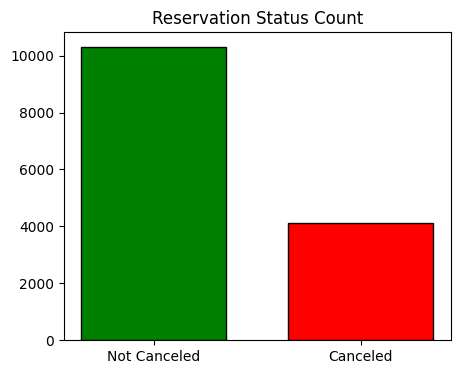
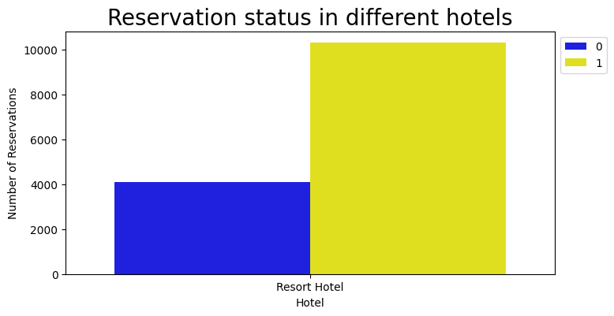
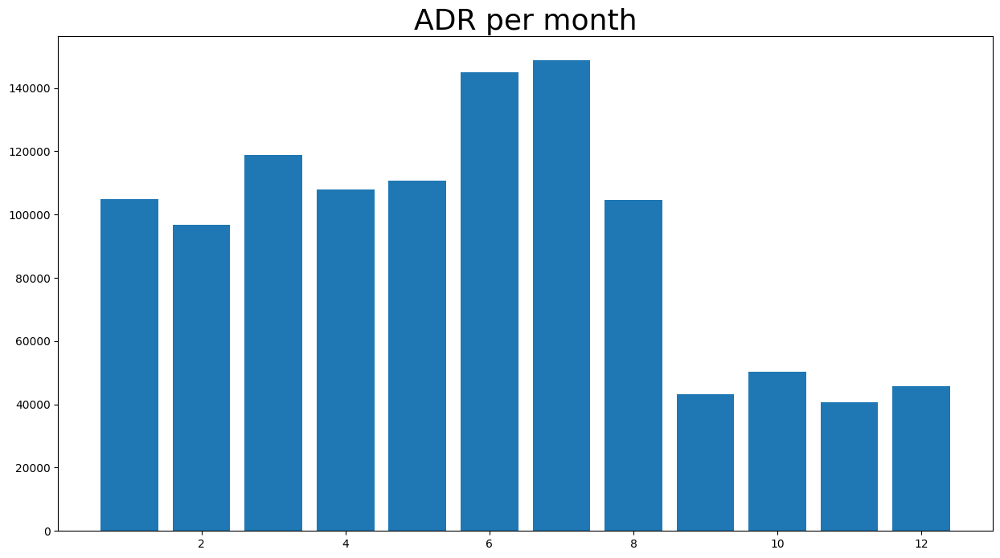
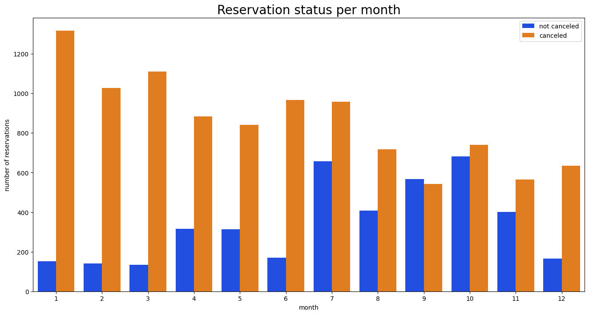
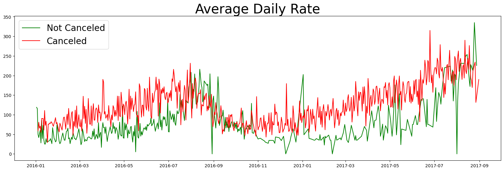
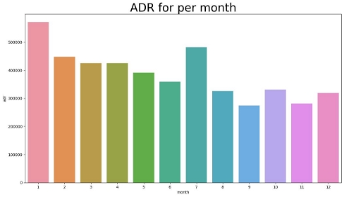
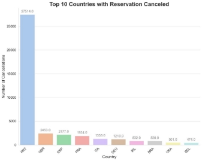
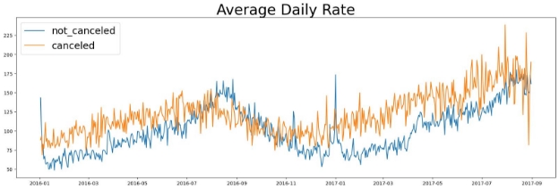

Hi, I'm Utkarsh Kumar from IIT Kharagpur. In this project, I focused on analyzing hotel reservation data to uncover trends in cancellations and their impact on revenue. My work involved examining cancellation patterns across different countries and market segments, analyzing the role of ADR (Average Daily Rate) in cancellation rates, and providing actionable recommendations for hotel management to reduce cancellations and maximize revenue.

# Hotel Cancellation and Loss Analysis with Recommendations

In recent years, both City Hotel and Resort Hotel have faced elevated cancellation rates, resulting in reduced revenue and suboptimal room utilization. This project aims to address this critical issue by identifying key factors contributing to cancellations and offering strategic recommendations to enhance hotel efficiency and profitability.

The analysis of hotel booking cancellations as well as other factors that have no bearing on their business and yearly revenue generation are the main topics of this report.

### Research Focus:

The analysis dives deep into the factors influencing hotel booking cancellations and their broader impact on business performance and annual revenue.

⚖️ Key Assumptions:
The data from 2015-2017 remains relevant without major disruptions affecting its reliability.
The analysis reflects current market conditions, offering actionable insights.
There are no unforeseen downsides to implementing the suggested strategies.
The hotels are not currently using the proposed solutions.
Booking cancellations are the primary challenge impacting revenue generation.
Cancellations result in unoccupied rooms for the intended duration of the stay.
Reservations and cancellations occur within the same year.
❓ Research Questions:
What variables contribute to hotel reservation cancellations?
How can the rate of hotel reservation cancellations be reduced?
How can hotels use this analysis to make informed pricing and promotional decisions?
🧠 Hypotheses:
Higher prices correlate with increased cancellations.
Longer waitlists lead to more frequent cancellations.
Most reservations are made through offline travel agents.

## Analysis and Findings:

#### Cancellation Rates Across Hotels:

A significant 37.1% of hotel reservations are canceled, leading to substantial revenue losses.
The analysis shows stark differences between City and Resort Hotels, with the Resort Hotel experiencing a higher cancellation rate (41.71%) compared to the City Hotel (27.98%).
It is crucial for hotel management to take proactive measures to address these disparities and reduce cancellations.

The graph shows the number of reservations canceled and not canceled for each hotel type, with the Resort Hotel facing a significantly higher proportion of cancellations (27.98%) compared to the City Hotel (41.71%). Further analysis revealed that 72.02% of reservations at the Resort Hotel were not canceled, while only 58.29% of reservations at the City Hotel were not canceled. It is recommended that the Resort Hotel management takes proactive steps to reduce cancellation rates by identifying contributing factors and implementing appropriate measures. For the City Hotel, monitoring trends and identifying areas of improvement is necessary to maximize revenue and minimize losses.

#### Factors of Cancellation Analysis:

1. **Price(ADR) Analysis**

A significant 37.1% of hotel reservations are canceled, leading to substantial revenue losses.
The analysis shows stark differences between City and Resort Hotels, with the Resort Hotel experiencing a higher cancellation rate (41.71%) compared to the City Hotel (27.98%).
It is crucial for hotel management to take proactive measures to address these disparities and reduce cancellations.

2. **Monthly Booking Patterns**

The grouped bar graph illustrates the monthly distribution of canceled and not-canceled reservations for hotels. August has the highest number of reservations,(which may be a popular vacation month) while January has the highest number of canceled reservations (possibly due to post-holiday season blues). This data can be utilized to develop strategies to improve cancellation rates and increase revenue during slower months. Understanding monthly reservation patterns is essential to improve business performance and customer satisfaction.

3. **Combining both the above analysis and Concluding:**

The cancellation rate of hotel reservations is affected by multiple factors, including pricing and monthly reservation patterns. The bar graph displays the average daily rate per month for canceled reservations, highlighting that cancellations are more frequent when prices are higher. The monthly distribution of canceled and not-canceled reservations for hotels also shows that certain months, such as January, see a higher number of cancellations. These insights underscore the importance of analyzing both pricing and monthly patterns to develop effective strategies that reduce cancellations, increase revenue, and enhance customer satisfaction.

4. **Regional Analysis:**

 

The data above shows the top 10 countries with the highest percentage of canceled reservations, with Portugal at the top of the list, accounting for 70.07% of all cancellations. It is essential to recognize this information and take action to minimize the impact of cancellations on the business. By analyzing the reasons behind the high cancellation rates from these countries and making the necessary changes to marketing strategies, hotel management can attract more stable customers and improve overall revenue. Additionally, offering incentives to customers from these countries may help to encourage them to keep their reservations and reduce the number of cancellations.

5. **Market Segment Analysis:**

The analysis shows that the largest market segment is Online TA, representing almost 47.44% of all reservations. This is followed by Offline TA/TO and Groups, with 20.32% and 16.66% respectively. Direct and Corporate make up smaller proportions of the reservations, with 10.47% and 4.30% respectively. Finally, Complementary and Aviation make up a very small proportion of the reservations.

When looking at the percentage of cancellations by market segment, the Online TA segment still has the highest percentage of cancellations, with 46.97%. The Groups segment has the second highest percentage of cancellations, at 27.40%. The Offline TA/TO segment has the third highest percentage of cancellations at 18.75%. Direct and Corporate segments have lower percentages of cancellations, at 4.35% and 2.21% respectively. Complementary and Aviation segments have the lowest percentages of cancellations.

The data on market segment distribution and cancellation rates highlights the importance of developing effective strategies for managing cancellations. Hotel management can use this information to identify areas for improvement and implement policies that encourage more stable bookings, such as offering incentives for group bookings or introducing stricter cancellation policies for online bookings. By taking necessary actions to reduce cancellation rates across different market segments, hotels can improve their overall reservation rate and increase revenue.

#### Concluding Analysis:

The line graph above provides valuable insights into the relationship between average daily rate (ADR) and reservation cancellations over time. The blue line representing the ADR for reservations that were not canceled shows a steady increase over time, indicating a positive trend in revenue. On the other hand, the orange line representing the ADR for canceled reservations fluctuates significantly, suggesting that price volatility has a greater impact on cancellation rates.

The graph also confirms earlier findings that higher prices lead to higher cancellation rates. As the ADR increases, so does the percentage of reservations that are canceled, highlighting the need for careful pricing strategies to avoid losing revenue due to cancellations. By monitoring ADR trends and adjusting prices during times of high cancellation rates, stakeholders can better manage revenue and minimize cancellations.

Overall, the project has analyzed various factors that contribute to reservation cancellations, including the top countries with the highest cancellation rates, the distribution of cancellations across different market segments, and the relationship between ADR and cancellation rates. The insights gained from this analysis can help stakeholders develop effective strategies to reduce cancellations, increase revenue, and improve overall hotel performance.

## Recommendations:

Based on the analysis conducted, here are some suggestions aimed at addressing the business problem of reducing cancellation rates and increasing revenue:

Revise Pricing Strategy: Implement dynamic pricing to optimize room rates and reduce cancellations during high-demand periods.
Incentivize Early Bookings: Offer discounts or perks for reservations made well in advance to secure bookings.
Flexible Cancellation Policies: Introduce more lenient cancellation policies to accommodate customer needs and reduce last-minute cancellations.
Targeted Marketing Campaigns: Focus on high-cancellation segments like Online TA with tailored offers to encourage commitment and reduce churns.

